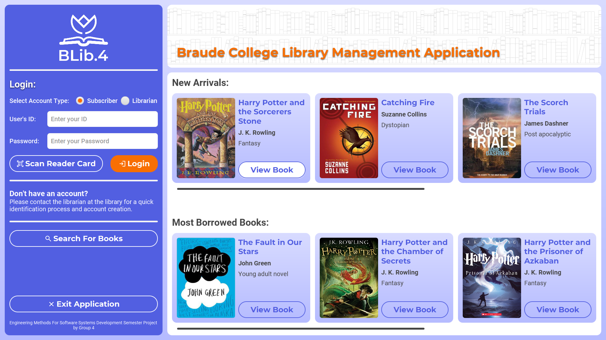
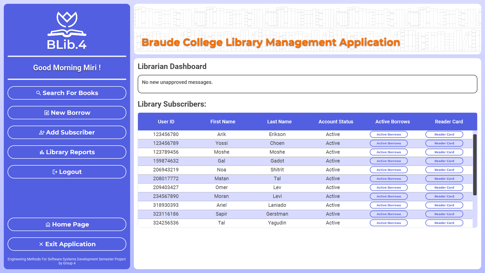

# BLib4

This application was developed as part of the "Engineering Methods for Software
 Development" course in a team of six members. The development spanned 3.5 months (one
 semester) and was conducted using the Agile Scrum methodology. 
 Key aspects include:
 * System analysis and software requirements dentition, including acceptance testing
 UML-based design using Use-Case, Activity, Class, Sequence, and Package diagrams
 * Implementation of a distributed architecture based on OCSF for Client-Server
 communication, utilizing the TCP/IP protocol
 * Creation of a relational database
 * GUI implementation using JavaFX
 * Integration of APIs such as JavaMail and ScheduledExecutorService

## Description

Blib4 is an education project that focus on creating full stack system that manage a library. The system written in Java and use JavaFx for the gui. The system also connect to MySql DB to manage the user and library data, the connecting to the DB handled using the library JDBC, the client-sever handled using OCSF.

## Getting Started
These instructions will get you a copy of the program up and running on your local machine.

### Prerequisites
In order to run the program, you'll need to have:
* G4_server.jar
* G4_client.jar
* 4_Assignment3_DB.sql - needed to be loaded to mysql with account root and password Aa123456
* .env - needed to edit the file and add email credentials 

All the files can be found in the [Run](Run/) folder

## Running the program locally
1. Make sure you loaded the DB file to MySql
2. Make sure you add email credentials in the .env file
3. Run the G4_server.jar and select the port
4. Run the G4_client.jar (on different computer or the same) and select the same port of the     server and the ip of the server computer
5. The system is up and can be used 

## Models

### System Use Case

### System Class Diagram

### Activity - loan return extend

### Activity - Membership status report

### Sequence Diagram - borrow book

### Sequence Diagram - Subscription Report

### Package Diagram

## System Screenshots

### Client Side

#### Home Page 

#### Search

#### Book

#### Librarian View

#### New Subscriber

#### Borrow book

#### Reports

#### Subscriber View

### Server Side

More screenshots can be found in the [screenshot](/Models/Screenshots/) folder